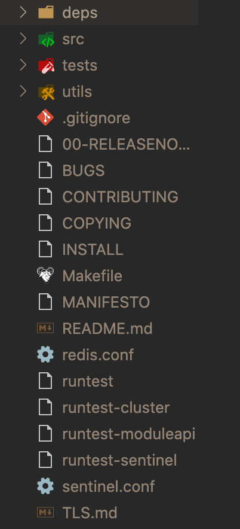
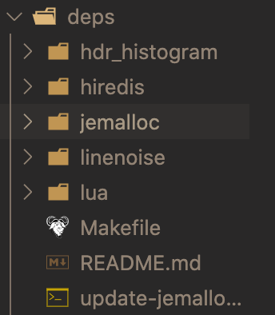

# 代码目录结构
## redis代码目录

> deps: 第三方依赖库
> src: 源码目录
> utils: 辅助工具目录
> tests: 测试目录

### deps文件夹结构

> hiredis: C实现的redis客户端
> jemalloc: 内存池工具
> lua: lua脚本源码
> linenoise: 命令行编辑库
> hdr_histogram: 直方图
## 启动
1. 在`readQueryFromClient`处设置断点。
2. client 链接
代码分析：

